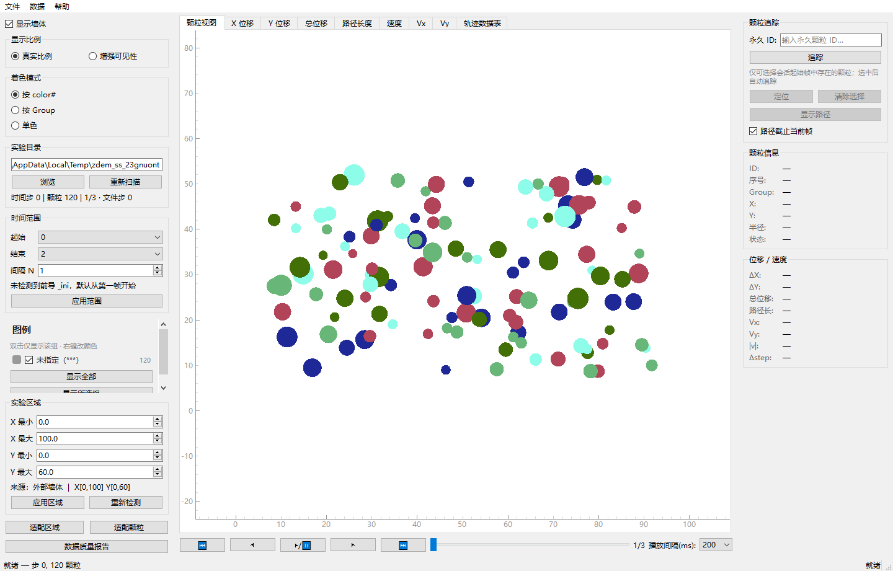
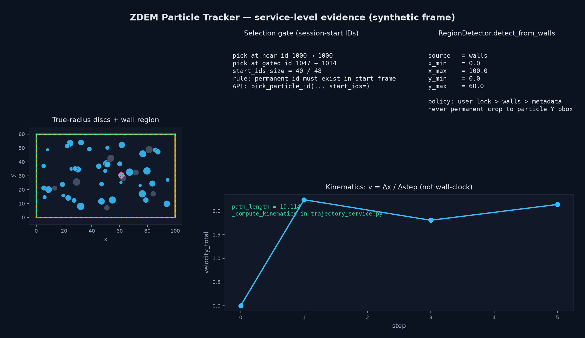

# ZDEM Particle Tracker

**Interactive 2D particle tracking for ZDEM discrete-element dumps — VisPy true-radius mesh discs, permanent IDs, explicit region policy.**

[English](README.md) | [中文](README.zh-CN.md)

[](https://github.com/Phoenix0531-sudo/ZDEM_ParticleTracker/actions/workflows/ci.yml)
[](LICENSE)
[](pyproject.toml)

Research desktop app for **ZDEM** frame sequences (`all_*.dat` / deposition `_ini` frames). Opinionated for salt-tectonics / granular DEM post-processing on Windows + Python — not a generic multi-physics GUI.

## Screenshots (real GUI grab)

<table>
  <tr>
    <td width="50%">
      
      <br><strong>MainViewer (Qt grab)</strong> — 120 particles, walls, Chinese UI, step 0 ready
    </td>
    <td width="50%">
      
      <br><strong>Service evidence</strong> — selection gate + v=Δx/Δstep card
    </td>
  </tr>
  <tr>
    <td colspan="2">
      
      <br><strong>Domain schematic</strong> — parse → region → mesh render → trajectory
    </td>
  </tr>
</table>

```bash
# real window grab (Windows Qt; uses valid synthetic ZDEM DAT)
uv run python scripts/capture_real_shots.py
uv run python scripts/generate_evidence.py
```

GUI shots use a **valid synthetic ZDEM DAT** (Parameter/Wall/Ball Data) so the canvas is not empty. Proprietary lab campaigns are not committed.

## Why this exists

| Pain | What this app does |
|------|---------------------|
| GL point sprites look fat / leave white halos when zooming | Default renderer draws **mesh discs in real space** (`VisPyRenderer`), not `GL_POINTS` |
| Silent empty plots after a bad click | Click path fills **permanent particle IDs**; gated by session-start ID set |
| Auto camera crop on particle Y bbox hides walls / box | **User lock > walls > metadata** (`RegionDetector`) |
| Multi-GB frame sets freeze the UI | Frame load worker, LRU cache, trajectory cancel + progress |

## Architecture (real packages)

```
main.py
zdem_particle_tracker/
  app.py                 # QApplication, Fusion style, APP_STYLESHEET
  parsers/dat_parser.py  # frame payload + find_particle_in_file
  parsers/dat_scan.py    # scan all_*.dat / _ini series
  rendering/
    vispy_renderer.py    # GPU mesh discs, walls, selection, trajectory
    cpu_raster.py        # fallback
    backend.py           # VisPy vs pyqtgraph selection
  services/
    region_detector.py   # walls → bbox; metadata fallback
    trajectory_service.py  # v = Δx/Δstep; cancelable worker
    export_service.py / quality_report.py / project_config.py
  widgets/
    main_viewer.py       # MainViewer entry
    selection_logic.py   # pure pick / gate helpers
  workers/frame_load_worker.py
  utils/frame_cache.py, color_mapping.py
```

Entry: `python main.py` → `zdem_particle_tracker.app.main` → `MainViewer`.

## Rendering details that matter

From `rendering/vispy_renderer.py`:

- Particles are **disc meshes** (`_DISC_SEGMENTS = 16`, reduced to 8 when far / dense)
- Viewport culling + optional decimation (`_MAX_DRAW_PARTICLES = 80000`)
- Mesh buffer reuse for frame scrubbing
- Walls as line sets; selection / trajectory are first-class layers
- On Windows Qt, canvas uses `create_native()` without the broken `show=False/parent=self` embed pattern

CPU / pyqtgraph path for headless CI (`ZDEM_FORCE_PYQTGRAPH=1`).

## Region policy

`services/region_detector.py`:

1. `detect_from_walls(walls)` — walls `(N,4)` as `[x1,y1,x2,y2]` → axis-aligned bbox; collinear / empty → fallback
2. `detect_from_metadata` — `left` / `right` / `bottom` / `height` (delta vs absolute-top heuristic)
3. UI **user-lock** so temporary “fit particles” zoom is not the permanent experiment region

Lab rule: **never treat particle Y-only bbox as the lasting experiment domain**.

## Tracking and kinematics

- Permanent particle ID across frames via `find_particle_in_file`
- Velocity definition: **`v = Δx / Δstep`** (simulation step), not wall-clock seconds — see `_compute_kinematics`
- Trajectory worker is cancelable with progress (`tests/test_trajectory_cancel.py`)
- Color modes include **color#** group coloring

## Install / run

```bash
git clone https://github.com/Phoenix0531-sudo/ZDEM_ParticleTracker.git
cd ZDEM_ParticleTracker
uv sync --extra dev
# or: pip install -r requirements.txt
python main.py
```

Python **>= 3.11**. Stack: PySide6, numpy, scipy, pyqtgraph, matplotlib, scienceplots; VisPy for mesh path.

Headless / CI:

```bash
set QT_QPA_PLATFORM=offscreen
set ZDEM_FORCE_PYQTGRAPH=1
uv run pytest -q tests
```

Linux Actions may isolate some Qt widgets in a subprocess (`tests/qt_subprocess.py`) to avoid process-wide aborts when mixing backends.

## Tests (what is actually covered)

| Area | Tests |
|------|-------|
| DAT parse / scan | `test_dat_parser.py`, `test_dat_scan.py` |
| Selection / gate | `test_selection_logic.py`, `test_selection_gate.py` |
| Region + kinematics | `test_region_and_kinematics.py` |
| Trajectory cancel | `test_trajectory_cancel.py` |
| Viewer / render / interaction | `test_viewer_logic.py`, `test_render_pixels.py`, `test_interaction_paths.py`, `test_gui_smoke.py` |
| Perf / deep paths | `test_perf_paths.py`, `test_deep_paths.py` |

## Related ZDEM tools

| Repo | Role |
|------|------|
| [ZDEM_Salt_Kinematics](https://github.com/Phoenix0531-sudo/ZDEM_Salt_Kinematics) | Salt geometry metrics |
| [ZDEM_Area_Conservation](https://github.com/Phoenix0531-sudo/ZDEM_Area_Conservation) | Area conservation / triangulation |
| [ZDEM_Bond_Fracture](https://github.com/Phoenix0531-sudo/ZDEM_Bond_Fracture) | Bond damage series |
| [ZDEM_Model_Editor](https://github.com/Phoenix0531-sudo/ZDEM_Model_Editor) | Model file visual editor |

## Scope

- **In:** ZDEM 2D dumps, interactive ID tracking, true-radius display, region locks, export/report hooks
- **Out:** 3D solver UI, cloud collaboration, automatic constitutive inversion
- Full-campaign GUI screenshots of proprietary lab data are not committed; use local runs + evidence script for public proof

## License

MIT. See [LICENSE](LICENSE).
