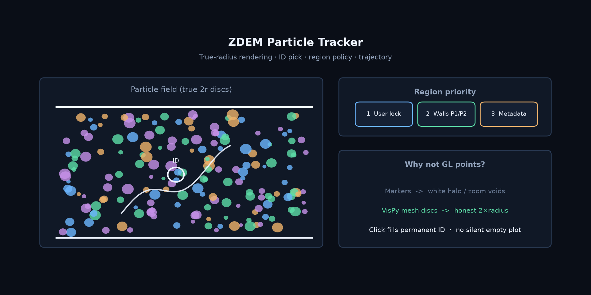

# ZDEM Particle Tracker

**面向 ZDEM 结果的交互式二维颗粒追踪，VisPy 真实半径网格渲染。**

[English](README.md) | [中文](README.zh-CN.md)

[](https://github.com/Phoenix0531-sudo/ZDEM_ParticleTracker/actions/workflows/ci.yml)
[](LICENSE)

点击填充永久 ID。区域策略明确。几何不说谎。

## 预览



## 功能

- VisPy 真实 2 倍半径 Mesh 圆盘（无界面 CI 可走 pyqtgraph）
- 区域优先级：用户锁定 > 墙 > 元数据（禁止永久仅按 Y 包围盒裁剪）
- 轨迹追踪：可取消 worker + 进度反馈
- 数据路径识别 color# 分组与墙列（P1/P2）
- Linux CI 用独立子进程构造 Qt 控件，避免 abort

## 快速开始

### 安装

```bash
git clone https://github.com/Phoenix0531-sudo/ZDEM_ParticleTracker.git
cd ZDEM_ParticleTracker
pip install -r requirements.txt
```

### 使用

```bash
python main.py

set QT_QPA_PLATFORM=offscreen
set ZDEM_FORCE_PYQTGRAPH=1
pytest tests/
```

## 项目结构

```
main.py
zdem_particle_tracker/
  widgets/  ui/  rendering/
tests/
```

## 相关 ZDEM 工具

| 仓库 | 作用 |
|------|------|
| [ZDEM_ParticleTracker](https://github.com/Phoenix0531-sudo/ZDEM_ParticleTracker) | 交互颗粒追踪 + 真实半径渲染 |
| [ZDEM_Salt_Kinematics](https://github.com/Phoenix0531-sudo/ZDEM_Salt_Kinematics) | 盐构造几何 / 运动学提取与出图 |
| [ZDEM_Area_Conservation](https://github.com/Phoenix0531-sudo/ZDEM_Area_Conservation) | 面积守恒 / 三角剖分分析 |
| [ZDEM_Bond_Fracture](https://github.com/Phoenix0531-sudo/ZDEM_Bond_Fracture) | 粘结损伤序列 + visualizer |
| [ZDEM_Damage_Thresholds](https://github.com/Phoenix0531-sudo/ZDEM_Damage_Thresholds) | 损伤阈值与能量图 |
| [ZDEM_DFN](https://github.com/Phoenix0531-sudo/ZDEM_DFN) | 离散裂隙网络生成 |
| [ZDEM_Model_Editor](https://github.com/Phoenix0531-sudo/ZDEM_Model_Editor) | 模型文件可视化编辑 |
| [ZDEM_Archiver](https://github.com/Phoenix0531-sudo/ZDEM_Archiver) | 大体积结果归档 / 清理 |
| [ZDEM3D_WEB](https://github.com/Phoenix0531-sudo/ZDEM3D_WEB) | CAE 云端界面 |


## 说明

面向盐构造 / 造山 DEM 研究流程的工具。

## 许可证

MIT。在注明出处的前提下可商业使用（以 LICENSE 为准）。详见 [LICENSE](LICENSE)。
